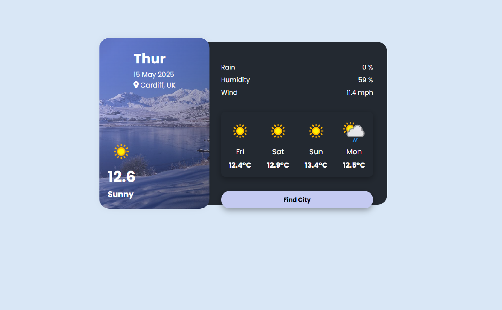

# Weather App

A simple weather app built with HTML, CSS and JavaScript that fetches live weather data using the WeatherAPI.
Uswes can view the current weather of their location or search for any city

## Features

    - Fetch current weather using city name
    - Detect user location using 'navigator.geolocation'
    - Display temperature, humidity, wind speed
    - Icons using Font Awesome

## Tech Stack

    - HTML
    - CSS
    - JavaScript
    - [WeatherAPI](https://www.weatherapi.com/)
    - Netify (for deployment)

## Screenshot

